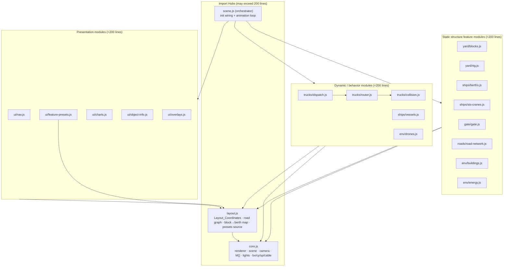
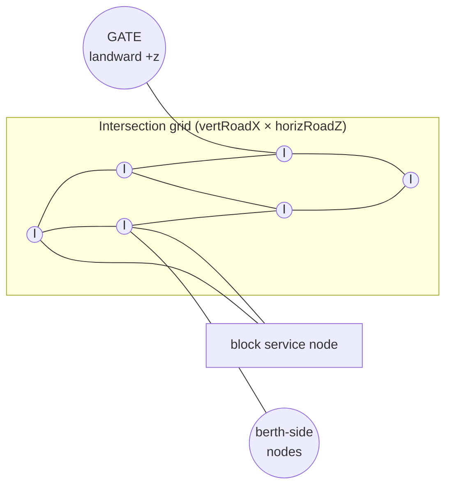
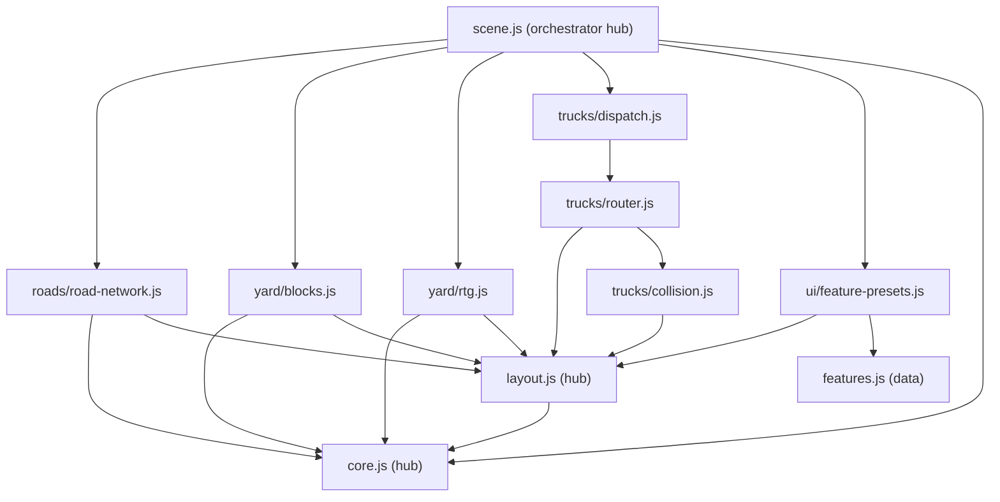

# Design Document

## Overview

This design expands the NDT15 Smart Port digital twin from 6 single-row container yard
blocks into a large-scale terminal of 20–30 blocks arranged in a grid that extends from the
quay toward the city, served by a rebuilt two-lane road network, a waypoint-graph truck
router with scalable collision avoidance, and relocated energy/port buildings — all while
holding 60 FPS on 8 GB VRAM machines and refactoring the source into focused modules.

The central idea is to **invert the current dependency structure**. Today, positions are
hardcoded independently in every file (`blockX` in `yard.js`, `berthXs` in `ships.js`, the
gate `z=85` in `gate.js`, lane arrays in `trucks.js`, camera presets in `features.js`). This
makes the layout impossible to scale without manual, error-prone edits in many places. The
new design introduces a single **`layout.js` import hub** that *derives* every position from
a small set of named parameters. Blocks, berths, RTG cranes, roads, the gate, trucks, and
camera presets all read from this one source, so the entire port stays geometrically
consistent and can be resized by changing parameters.

Two facts from the current codebase shape the whole design:

1. **The axis convention**: the water and berths sit at negative `z` (`BERTH_Z = -22`), and
   the city/gate sit at positive `z` (city at `z = 1000`, gate at `z = 85`). "Toward the
   city" therefore means **increasing `z`**. The expanded yard grows in `+z`, with the gate
   pushed further out in `+z` ahead of the first block row.

2. **The quay is fixed-length but blocks multiply**: berths line a fixed quay (~600 units
   wide along `x`). The current code naively sets `berthXs === blockX`, which only works
   because there were 6 of each. With 20–30 blocks the counts diverge, so the design defines
   an explicit **many-blocks-to-fewer-berths mapping** by `x`-proximity, decoupling berth
   count from block count.

### Research notes informing the design

- **Real-world reference**: large digital-twin terminals (e.g. 51WORLD's Shanghai-scale
  model) arrange container blocks in a dense rectangular grid of *bays* separated by
  perpendicular haul roads, with the quay/STS cranes on one edge and the truck gate on the
  opposite (landward) edge. This validates the "grid extending toward the city, gate at the
  far landward end" topology. (General domain knowledge; no verbatim source reproduced.)
- **Three.js r0.160 instancing**: `InstancedMesh` renders all instances of one
  geometry+material pair in a single draw call. The existing `yard.js` already proves this
  pattern (4 buckets → 4 draw calls). Scaling to 24 blocks therefore costs **zero additional
  container draw calls** if all blocks share the same 4 buckets — the cornerstone of the
  performance strategy.
- **Shadow texel density**: directional-light shadow sharpness equals
  `mapSize / frustumWidth`. The current value is `2048 / 900 ≈ 2.27` texels/unit. Growing the
  yard widens the required frustum, so density is preserved by either tightening the frustum
  to bound *only* the yard (not the distant ocean/turbines) and/or raising `mapSize` to the
  4096 cap. This is the basis for Requirement 9.2 and 9.7.

## Architecture

### Layered architecture



### Key architectural rules

- **Single source of truth for positions** (Req 3): only `layout.js` defines coordinates.
  Every other module imports derived values; none redefines a coordinate locally (Req 10.4,
  10.5).
- **Hubs vs. features**: `core.js`, `layout.js`, and `scene.js` are *Import_Hubs* and may
  exceed 200 lines (Req 10.2). All feature modules stay under ~200 source lines (Req 10.1).
- **Build-time vs. frame-time separation**: static structure (blocks, roads, gate, berths,
  buildings) is built once at init. The animation loop only mutates transforms of dynamic
  objects (trucks, cranes' moving parts, vessels) using preallocated scratch state — no
  geometry/material/vector allocation per frame (Req 9.3).
- **Graph-driven traffic**: the road network is both *rendered geometry* and a *routing
  graph*. Both are derived from the same `layout.js` data so a road you can see is a road a
  truck can drive (Req 4.4, 5.1).

## Components and Interfaces

### `layout.js` (new Import Hub) — the keystone

Exposes pure, deterministic derivations. No Three.js objects, only numbers and plain data —
which makes it directly testable.

```text
// Parameters (the only place layout is "decided")
PARAMS = { COLS, ROWS, BLOCK_W, BLOCK_D, ROAD_W, LANE_HALF,
           ROW_PITCH, COL_PITCH, YARD_Z0, QUAY_Z, BERTH_Z,
           QUAY_LEN, BERTH_SPACING, GATE_GAP, APRON_MARGIN }

// Derived accessors (all pure functions of PARAMS)
blockCenter(col, row) -> {x, z}        // grid position of a block
blockId(col, row)     -> number        // unique 1..COLS*ROWS
vertRoadX()           -> number[]       // centerlines between/around columns
horizRoadZ()          -> number[]       // centerlines between/around rows
laneCenters(roadCenter, axis) -> [inX, outX] | [inZ, outZ]
berthX()              -> number[]       // from QUAY_LEN / BERTH_SPACING (NOT block count)
blockToBerth(col,row) -> berthIndex     // nearest berth by x
gatePosition()        -> {x, z}         // landward end, +z beyond last row
gateLaneX()           -> number[]       // aligned to central vertical roads
apronBounds()         -> {minX,maxX,minZ,maxZ}
roadGraph()           -> { nodes, edges } // see Data Models
validateLayout()      -> {ok, badKey?}    // finiteness/completeness check (Req 3.4)
```

**Interface contract**: every consumer calls these accessors at init and on any layout
change; results are guaranteed finite when `validateLayout().ok` is true.

### `roads/road-network.js`

Consumes `vertRoadX()`, `horizRoadZ()`, `apronBounds()`. Builds:
- One merged road surface mesh (or a few large planes) covering all corridors.
- Lane-divider markings (center dashed line per corridor) and directional arrows, each at a
  small `+y` offset (`ROAD_Y + ε`) above the road to prevent z-fighting (Req 4.5). Markings
  reuse shared geometries via `bx` and the shared `M.mark` material.

### `yard/blocks.js`

Consumes `blockCenter`, `blockId`. Produces **exactly 4 `InstancedMesh` objects** (one per
container color bucket) whose instances span *all* blocks (Req 1.3, 9.1). Instance matrices
are computed once with the shared `dummy` `Object3D`.

### `yard/rtg.js`

One RTG crane per block (Req 1.5). Static structural members (legs, top beams, wheels) are
batched into **per-part `InstancedMesh`** across all cranes to bound draw calls (Req 9.4);
the small moving group (trolley, spreader, rope, cargo) remains a per-crane object because it
animates. The RTG state machine (existing states 0–15) is preserved but its block/lane
targets come from `layout.js`.

### `ships/berths.js`, `ships/sts-cranes.js`, `ships/vessels.js`

Berths and STS cranes positioned from `berthX()` (independent of block count). Vessel docking
reference points align to their serving quay position within 0.1 units (Req 3.3). The
`vesselPose` cycle logic is unchanged except `bx` values come from `layout.js`.

### `gate/gate.js`

Positioned at `gatePosition()` (landward, large `+z`). Lane X values from `gateLaneX()`.
Every inbound route passes the gate before any block (Req 7.2) because the gate sits beyond
the last block row in `+z` and all inbound paths originate there.

### `trucks/` (router, collision, dispatch, truck-mesh)

- `truck-mesh.js`: builds the shared truck visual (geometry/material reused).
- `router.js`: waypoint-graph pathfinding + the driving state machine.
- `collision.js`: per-frame spacing, following gaps, and intersection reservations.
- `dispatch.js`: spawn/re-dispatch with separation guarantees.

### `ui/feature-presets.js`

Recomputes each feature's `cp/fp/ft` from the bounds of the element it represents (berths,
yard, gate, radar, energy, overview) using `layout.js` accessors (Req 8). `features.js`
keeps descriptive metadata only; numeric presets are produced here.

## Data Models

### Layout_Coordinates (parameter-driven)

Representative default parameters (tunable; chosen to land in the 20–30 block range):

```text
COLS = 6, ROWS = 4            -> 24 blocks (20 ≤ 24 ≤ 30)        (Req 1.1)
BLOCK_W = 24, BLOCK_D = 42    -> block footprint
ROAD_W  = 24                  -> two-lane corridor (2 lanes ~8 + markings + ≥0.5 clearance/side)
LANE_HALF = 5                 -> lane centerline offset from corridor center
COL_PITCH = BLOCK_W + ROAD_W = 48
ROW_PITCH = BLOCK_D + ROAD_W = 66
YARD_Z0 = 45                  -> center z of row 0 (just inland of quay)
QUAY_Z  = 1, BERTH_Z = -22    -> unchanged waterfront
QUAY_LEN = 600, BERTH_SPACING = 90 -> 6 berths (independent of block count)
GATE_GAP = 45                 -> gate sits this far beyond last row
APRON_MARGIN ≥ 2              -> clearance to apron edge (Req 2.1)
```

Derived (example with defaults):

```text
blockCenterX(col) = (col - (COLS-1)/2) * COL_PITCH      -> [-120,-72,-24,24,72,120]
blockCenterZ(row) = YARD_Z0 + row * ROW_PITCH           -> [45,111,177,243]
vertRoadX  = midpoints + perimeter                      -> [-144,-96,-48,0,48,96,144]
horizRoadZ = midpoints + front + gate cross             -> [12,78,144,210,276]
berthX     = evenly across QUAY_LEN                      -> [-150,-90,-30,30,90,150]
gateZ      = blockCenterZ(ROWS-1) + BLOCK_D/2 + GATE_GAP -> ≈ 309
apronBounds= bounding box of all blocks+roads + margin
```

### Road graph (routing model)



```text
Node = { id, x, z, kind: 'crossing'|'gate'|'service'|'berthside' }
Edge = { id, fromNode, toNode, dir: 'inbound'|'outbound', laneCenterX|laneCenterZ, length }
       // each physical corridor yields TWO directed edges (opposing lanes)  (Req 4.1)
RoadGraph = { nodes: Node[], edges: Edge[], adj: number[][] }  // adjacency by node id
```

The graph is a regular grid, so connectivity from every block to both the gate and the
berth-side area is structural (Req 4.4). Pathfinding uses BFS/Dijkstra over `adj`; because
the grid is regular and small, paths can also be precomputed per (gate ↔ block) pair at init.

### Truck state

```text
Truck = {
  id,                         // stable identifier; lowest-id wins ties (Req 6.3)
  g, cargo, hl, plate,        // visuals (unchanged)
  state,                      // driving state machine phase
  path: Int16Array,           // node ids, length-prefixed, preallocated (no per-frame alloc)
  pathLen, pathIdx,           // current progress along path
  edgeId,                     // current directed edge (for lane bucketing)
  s,                          // scalar progress along current edge [0..length]
  assignedBlock, isImport,    // dispatch info
  servingRtg,                 // handoff target
  hold                        // boolean: held by collision/intersection logic
}
```

### Frame-time scratch (preallocated once — Req 6.7, 9.3)

```text
laneBuckets[edgeId] = Int16Array(MAX_TRUCKS)   // truck ids on each directed edge
laneCount[edgeId]   = number                   // valid length; cleared via length reset
crossingOwner[nodeId] = Int16Array             // truck id occupying a crossing, or -1
_v1, _v2, _dir = THREE.Vector3 (module-level)  // reused vectors
```

## Correctness Properties

*A property is a characteristic or behavior that should hold true across all valid executions
of a system — essentially, a formal statement about what the system should do. Properties
serve as the bridge between human-readable specifications and machine-verifiable correctness
guarantees.*

This feature's **pure logic layers** — layout derivation, the road graph, routing, collision
avoidance, and preset geometry — are suitable for property-based validation because they are
deterministic functions of parameters/state with universal invariants over a large input
space (block counts 20–30, arbitrary truck configurations). The rendering, environment
loading, charts, and visual styling are validated visually.

The following properties are derived from the prework analysis and consolidated to remove
redundancy.

### Property 1: Layout produces a valid block count

*For any* parameter set with `COLS * ROWS` in `[20, 30]`, the derived block list contains
exactly `COLS * ROWS` blocks, each with a unique id.

**Validates: Requirements 1.1, 1.4**

### Property 2: No geometric overlap and city-ward growth

*For any* valid parameter set, no two blocks overlap, no block overlaps a road corridor, the
quay, a berth, or an RTG footprint, and every block center has `z ≥ YARD_Z0` (i.e. blocks
only extend toward the city, never back past the original footprint toward the quay).

**Validates: Requirements 1.2, 1.6, 7.1**

### Property 3: Everything fits inside the apron with clearance

*For any* valid parameter set, every block and every road segment lies within
`apronBounds()`, and the minimum distance from the outermost element edge to the apron edge
is at least `APRON_MARGIN` (≥ 2). Each inter-block gap is at least one full road corridor
width plus 0.5 clearance on each side.

**Validates: Requirements 2.1, 2.2**

### Property 4: Single-source derivation is consistent

*For any* change to the parameters, the positions of berths, RTG cranes, the gate, and the
road network recomputed from `layout.js` match their derived values within 0.1 units, and
each vessel berthing reference matches its serving quay position within 0.1 units on each
axis.

**Validates: Requirements 3.1, 3.2, 3.3**

### Property 5: Invalid layout is detected and rejected

*For any* parameter set containing a missing, incomplete, or non-numeric value,
`validateLayout()` returns `ok = false` and identifies the offending key, and positioning is
skipped so previously valid positions are retained.

**Validates: Requirements 3.4**

### Property 6: Road network connectivity and lane structure

*For any* valid parameter set, the road graph contains exactly two opposing directed lanes
per physical corridor, and there exists a path from every block service node to both the gate
node and a berth-side node.

**Validates: Requirements 4.1, 4.4**

### Property 7: Routing uses correct lane direction and never drops a truck

*For any* truck dispatched to any block, the computed inbound route from the gate consists
only of inbound-direction edges ending at the assigned block's service node; the return route
consists only of outbound-direction edges ending at the gate; and if no route can be computed
the truck is held (not removed) and routing is retried on later frames.

**Validates: Requirements 5.1, 5.2, 5.7**

### Property 8: Trucks stay within their lane

*For any* truck traveling along an edge, its lateral position equals that edge's lane
centerline within half the lane width, so its geometry never crosses the lane divider into
the opposing lane.

**Validates: Requirements 5.3**

### Property 9: Following gap prevents same-lane overlap

*For any* set of trucks sharing a directed edge, after a collision-avoidance evaluation every
trailing truck maintains at least a 2.0 m gap between its front and the leading truck's rear,
so no two truck geometries overlap.

**Validates: Requirements 6.1, 6.4**

### Property 10: Crossings are mutually exclusive with deterministic tie-break

*For any* configuration of trucks approaching a shared crossing, at most one truck occupies
the crossing area at a time; when contenders have equal distance-to-crossing the one with the
lowest id proceeds and all others are held until the crossing clears.

**Validates: Requirements 6.2, 6.3, 6.4**

### Property 11: Dispatch and re-dispatch preserve minimum separation

*For any* re-dispatch, a truck is placed only at a position keeping at least 2.0 m separation
from every other truck; if no such position exists the placement is delayed and retried,
never producing an overlapping spawn.

**Validates: Requirements 5.6, 6.5, 6.6**

### Property 12: Handoff to a serving crane

*For any* truck that reaches its assigned block's service node, it is handed to an available
RTG crane serving that block; if none is available it is held stationary at the service node
without overlapping another truck until one becomes available.

**Validates: Requirements 5.4, 5.5**

### Property 13: Frame evaluation is allocation-free

*For any* frame, the collision-avoidance evaluation runs once and completes without allocating
new objects (it only reads positions and writes into preallocated scratch buffers).

**Validates: Requirements 6.7, 9.3**

### Property 14: Camera presets frame their element; overview contains everything

*For any* valid parameter set, each feature preset's `fp` and `ft` lie within the horizontal
and depth bounds of the element it represents, and the overview preset's view bounds contain
the full horizontal and depth extent of the yard, roads, quay, and berths.

**Validates: Requirements 8.1, 8.4**

### Property 15: Container draw calls are constant across scale

*For any* block count in `[20, 30]`, the number of container `InstancedMesh` objects (and thus
container draw calls) is exactly the number of color buckets (4), independent of block count,
and each repeated structure type shares exactly one geometry and one material instance.

**Validates: Requirements 9.1, 9.4**

## Error Handling

- **Invalid layout (Req 3.4)**: `validateLayout()` runs before any positioning pass. On
  failure it logs `console.error` naming the bad parameter/derived key and the positioning
  step is aborted, leaving the last valid transforms in place. Consumers treat a failed
  validation as a no-op rather than crashing the loop.
- **Unroutable truck (Req 5.7)**: if pathfinding returns no path, the truck enters a `hold`
  state at the gate; `router.js` re-attempts on subsequent frames. The truck is never removed
  from `trucks[]`.
- **No spawn slot (Req 6.6)**: `dispatch.js` scans candidate spawn positions; if all violate
  the 2.0 m separation it returns "deferred" and the truck stays pending until a later frame.
- **Crane unavailable (Req 5.5)**: the truck holds at its service node (already modeled by the
  existing `state 3.1` idle-wait), now with an explicit non-overlap guarantee via the same
  following-gap check used on roads.
- **Asset load failure**: GLB/EXR loaders (city, ship, turbine, sky) keep the existing
  graceful-pending pattern (`pendingTurbines`, `pendingShipGroups`); a missing asset leaves a
  placeholder/empty group rather than throwing.
- **Module resolution (Req 10.6)**: the import graph is acyclic (hubs depend only on
  `core.js`/`layout.js`); the orchestrator is the only entry that imports feature modules,
  avoiding circular imports that would surface as console errors.

## Testing Strategy

Per the requirements, **no automated test suite is mandated** for this feature and primary
validation is visual via the running static server. However, the pure-logic layers above
have clear universal invariants, so this design specifies property-based-style validation as
the recommended approach for those layers, complemented by visual checks for rendering.

### Recommended property-based validation (pure logic)

- **Scope**: `layout.js` derivations, `roads/road-graph` connectivity, `trucks/router.js`
  pathfinding, `trucks/collision.js` spacing/intersection logic, and `ui/feature-presets.js`
  geometry. These are pure functions of parameters/state and need no Three.js runtime.
- **Library**: if/when a harness is introduced, use **fast-check** (the standard JS
  property-testing library) — do not hand-roll generators.
- **Configuration**: each property test runs **≥ 100 generated iterations**, generating block
  counts in `[20, 30]` and randomized truck arrangements.
- **Tagging**: each test references its design property, e.g.
  `// Feature: port-scale-expansion, Property 9: Following gap prevents same-lane overlap`.
- **Coverage**: implement Properties 1–15, one property-based test each.

### Example-based / edge-case checks

- Boundary block counts: exactly 20 and exactly 30 blocks (Property 1, 15).
- Single-truck and max-truck-count crossing contention (Property 10).
- Layout with a deliberately `NaN`/missing parameter (Property 5).
- Empty road graph / disconnected node sanity (Property 6).

### Visual / manual validation (rendering & integration)

- Confirm grid layout, lane markings without z-fighting, gate at landward end, relocated
  buildings/energy, and smooth camera preset transitions in the browser.
- Verify console shows **zero module import errors** on load (Req 10.6).
- Spot-check frame timing with the browser performance panel against the 16.7 ms average /
  33.3 ms worst-case targets on an 8 GB VRAM machine (Req 9.5, 9.6) — these are
  environment-dependent and not unit-testable.

### Performance verification (static/smoke checks)

- Assert container `InstancedMesh` count == 4 regardless of block count (Property 15 — can be
  a fast unit assertion).
- Assert `sun.shadow.mapSize` ≤ 4096 and shadow texel density ≥ pre-expansion baseline after
  frustum sizing (Req 9.2, 9.7).

## Modular Refactor Plan

### Old → new responsibility map

| Current file | Lines (approx) | New modules |
|---|---|---|
| `core.js` | ~90 | **`core.js`** (hub, unchanged role) |
| — | — | **`layout.js`** (NEW hub: all coordinates + road graph + block→berth map) |
| `main.js` | ~470 | **`scene.js`** (orchestrator hub: init + loop), `env/sky.js`, `env/ocean.js`, `env/land.js`, `env/models.js`, `env/buildings.js`, `env/energy.js`, `env/flags.js`, `env/drones.js`, `env/particles.js`, `boards/electronic-boards.js`, `interaction/raycast-follow.js` |
| `yard.js` | ~210 | `yard/blocks.js`, `yard/rtg.js`, `yard/block-screens.js` |
| `ships.js` | ~250 | `ships/berths.js`, `ships/vessels.js`, `ships/sts-cranes.js`, `ships/berth-screens.js` |
| `gate.js` | ~150 | `gate/gate.js`, `gate/gate-screens.js` |
| `trucks.js` | ~300 | `trucks/truck-mesh.js`, `trucks/router.js`, `trucks/collision.js`, `trucks/dispatch.js` |
| `ui.js` | ~780 | `ui/nav.js`, `ui/feature-presets.js`, `ui/charts.js`, `ui/object-info.js`, `ui/radar-popover.js`, `ui/overlays.js`, `ui/daynight.js` |
| `features.js` | ~190 | `features.js` (metadata only; numeric presets move to `ui/feature-presets.js`) |
| `roads` (was inline in `main.setupCoreScene`) | — | `roads/road-network.js` |

Each feature module targets < 200 source lines (Req 10.1). `core.js`, `layout.js`, and
`scene.js` are the designated Import_Hubs permitted to exceed it (Req 10.2). Behavior of
yard, ships, gate, trucks, gate screens, and UI is preserved through the split (Req 10.3);
the only behavioral changes are those required by the expansion itself.

### Import graph (acyclic)



There are no cycles: feature modules depend only on the two foundational hubs (`core.js`,
`layout.js`) and, in a few cases, a sibling within the same domain (router→collision,
dispatch→router). Only `scene.js` imports the feature modules, so initialization order and
the animation loop live in one place (Req 10.6).
